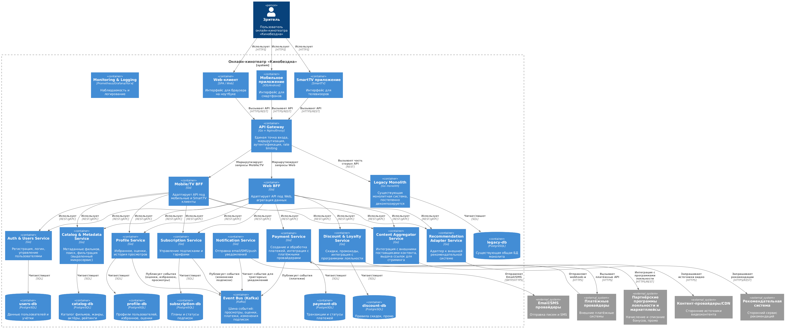
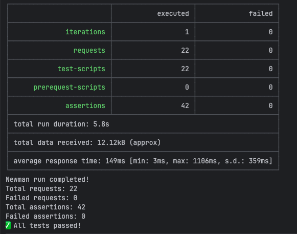
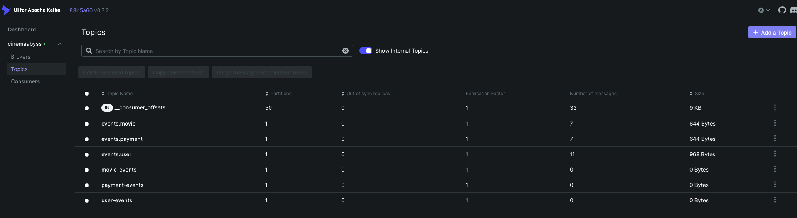
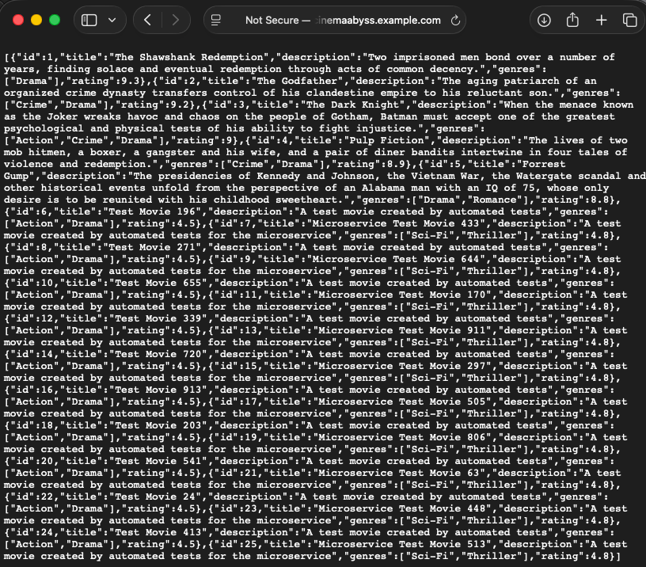
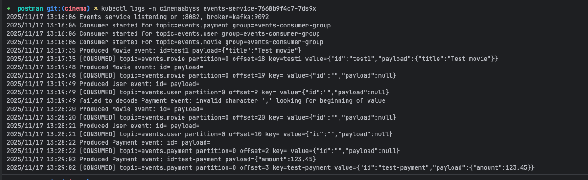
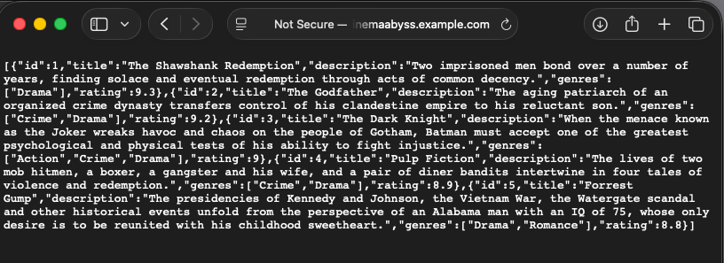
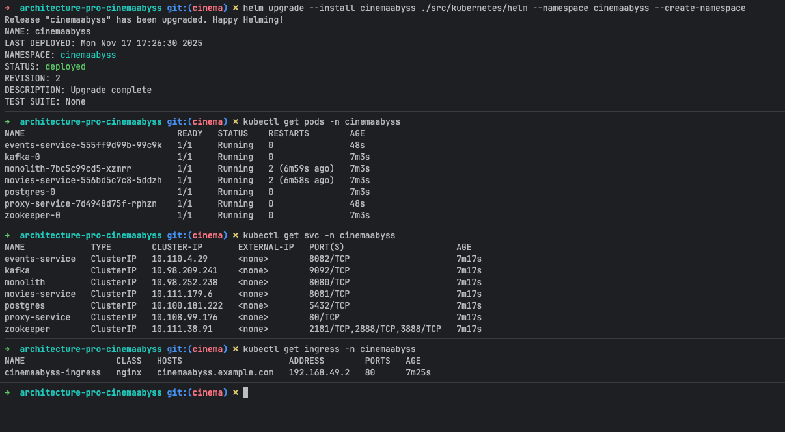

## Изучите [README.md](README.md) файл и структуру проекта.

## Задание 1

   ### Основные домены
   1. Пользователи и аутентификация
        1. Управление аккаунтами
        2. Логин/регистрация/SSO
        3. Сессии, токены, роли
   2. Профиль пользователя и предпочтения
        1. Папки «избранное», оценки фильмов
        2. История просмотров
        3. Персональные настройки 
   3. Каталог и метаданные (выносимый микросервис по ТЗ)
       1. Фильмы, сериалы, сезоны, эпизоды
       2. Жанры, актёры, рейтинги, страны и т.д.
       3. Поиск и фильтрация
   4. Подписки и биллинг
       1. Тарифы, статусы подписок
       2. Привязка к пользователям
       3. Состояние активности подписки, пробные периоды
   5. Платежи и интеграция с платёжными системами
       1. Создание и проведение платежей
       2. Webhook’и платёжных провайдеров
       3. Возвраты, фиксация статусов транзакций
   6. Скидки, акции, программы лояльности
       1. Купоны, промокоды
       2. Интеграции с внешними программами лояльности/маркетплейсами
       3. Расчёт финальной цены
   7. Контент и воспроизведение (агрегатор)
       1. Интеграция с внешними контент-провайдерами
       2. Получение доступных источников видео по правам/региону
       3. Выдача клиенту ссылок на стримы/CDN
   8. Рекомендательная система (внешняя)
       1. Адаптер для общения с внешним рекомендательным сервисом
       2. Получение списков рекомендаций по пользователю
   9. События и аналитика (Kafka MVP)
       1. Логирование событий: просмотр, оценка, добавление в избранное
       2. Публикация в Kafka
       3. Подписчики для аналитики, фрод-контроля, персонализации
   10. Уведомления и маркетинг
       1. Email/SMS/push
       2. Триггерные и массовые кампании (по событиям из Kafka)
   11. Единая точка входа / API Gateway + BFF
       1. API Gateway — маршрутизация, аутентификация, rate limiting, кросс-доменные задачи
       2. BFF (Backend for Frontend) — адаптация API под Web, Mobile, SmartTV (разный объём данных, разные формы)
   12. Legacy-монолит
       1. Части функционала, которые пока не вынесены в отдельные сервисы
       2. Работает за API Gateway бок о бок с новыми микросервисами



(C4) — описание

1. Пользователи и внешние системы
   1. Зритель – использует:
   2. Web-клиент (браузер на ноутбуке)
   3. Мобильное приложение (iOS/Android)
   4. SmartTV приложение
2. Внешние системы:
    1. Платёжные провайдеры
    2. Рекомендательная система
    3. Партнёрские программы лояльности / маркетплейсы
    4. Внешние источники контента/CDN
    5. Email/SMS-провайдеры
3. Контейнеры внутри системы «Кинобездна»
    1. PI Gateway (Единая точка входа для всех клиентов, Проверка токенов, маршрутизация по микросервисам, rate limiting, скрывает от клиентов внутреннюю микросервисную топологию)
    2. Web BFF (Адаптирует ответы под веб-интерфейс, объединяет данные из нескольких микросервисов в один ответ)
    3. Mobile/TV BFF (Лёгкие, оптимизированные ответы, Другие форматы/объёмы данных для мобильных и SmartTV интерфейсов)
    4. Auth & Users Service (Go-сервис, собственная БД users-db, Регистрация, логин, refresh токены, профили пользователей (базовые данные) )
    5. Profile Service (Избранное, оценки, история; БД profile-db; Публикует события в Kafka (оценка поставлена, добавил в избранное и т.п.))
    6. Catalog & Metadata Service (Управляет сущностями: фильмы, сериалы, жанры, актёры, рейтинги; БД catalog-db (PostgreSQL), изолированная; REST/gRPC API для поиска и фильтрации) 
    7. Subscription Service (Управление планами и статусами подписок; БД subscription-db; Проверка активности подписки при просмотре)
    8. Payment Service (Создание платежей, взаимодействие с внешними платёжными провайдерами; Приём webhook’ов, фиксация статуса платежа; БД payment-db; Публикует события в Kafka (успешный платёж, отказ))
    9. Discount & Loyalty Service (Скидки, промокоды, интеграции с программами лояльности, маркетплейсами; БД discount-db; Зовётся из Payment/Subscription для расчёта конечной цены)
    10. Content Aggregator Service (Интеграция с внешними контент-платформами; Проверяет права, регион пользователя, доступность; Возвращает клиенту конечные ссылки на стрим/CDN)
    11. Recommendation Adapter Service (Адаптер для внешней рекомендательной системы; Получает рекомендации по пользователю/профилю/истории) 
    12. Notification Service (Отправка email/SMS/push; Получает события из Kafka и триггерит уведомления)
    13. Event Bus (Kafka) - (события о платежах, оценках, избранном, просмотре контента, сменах статуса подписки
    14. Legacy Monolith (Старый Go-монолит + общая БД legacy-db
    15. Общие инфраструктурные контейнеры (Monitoring & Logging (Prometheus, Grafana, Loki/ELK); CI/CD Runner/Agent (GitLab CI, GitHub Actions runners и т.д.)

## Задание 2




## Задание 3




## Задание 4




# Задание 5
Компания планирует активно развиваться и для повышения надежности, безопасности, реализации сетевых паттернов типа Circuit Breaker и канареечного деплоя вам как архитектору необходимо развернуть istio и настроить circuit breaker для monolith и movies сервисов.

```bash

helm repo add istio https://istio-release.storage.googleapis.com/charts
helm repo update

helm install istio-base istio/base -n istio-system --set defaultRevision=default --create-namespace
helm install istio-ingressgateway istio/gateway -n istio-system
helm install istiod istio/istiod -n istio-system --wait

helm install cinemaabyss .\src\kubernetes\helm --namespace cinemaabyss --create-namespace

kubectl label namespace cinemaabyss istio-injection=enabled --overwrite

kubectl get namespace -L istio-injection

kubectl apply -f .\src\kubernetes\circuit-breaker-config.yaml -n cinemaabyss

```

Тестирование

# fortio
```bash
kubectl apply -f https://raw.githubusercontent.com/istio/istio/release-1.25/samples/httpbin/sample-client/fortio-deploy.yaml -n cinemaabyss
```

# Get the fortio pod name
```bash
FORTIO_POD=$(kubectl get pod -n cinemaabyss | grep fortio | awk '{print $1}')

kubectl exec -n cinemaabyss $FORTIO_POD -c fortio -- fortio load -c 50 -qps 0 -n 500 -loglevel Warning http://movies-service:8081/api/movies
```
Например,

```bash
kubectl exec -n cinemaabyss fortio-deploy-b6757cbbb-7c9qg  -c fortio -- fortio load -c 50 -qps 0 -n 500 -loglevel Warning http://movies-service:8081/api/movies
```

Вывод будет типа такого

```bash
IP addresses distribution:
10.106.113.46:8081: 421
Code 200 : 79 (15.8 %)
Code 500 : 22 (4.4 %)
Code 503 : 399 (79.8 %)
```
Можно еще проверить статистику

```bash
kubectl exec -n cinemaabyss fortio-deploy-b6757cbbb-7c9qg -c istio-proxy -- pilot-agent request GET stats | grep movies-service | grep pending
```

И там смотрим 

```bash
cluster.outbound|8081||movies-service.cinemaabyss.svc.cluster.local;.upstream_rq_pending_total: 311 - столько раз срабатывал circuit breaker
You can see 21 for the upstream_rq_pending_overflow value which means 21 calls so far have been flagged for circuit breaking.
```

Приложите скриншот работы circuit breaker'а

Удаляем все
```bash
istioctl uninstall --purge
kubectl delete namespace istio-system
kubectl delete all --all -n cinemaabyss
kubectl delete namespace cinemaabyss
```
